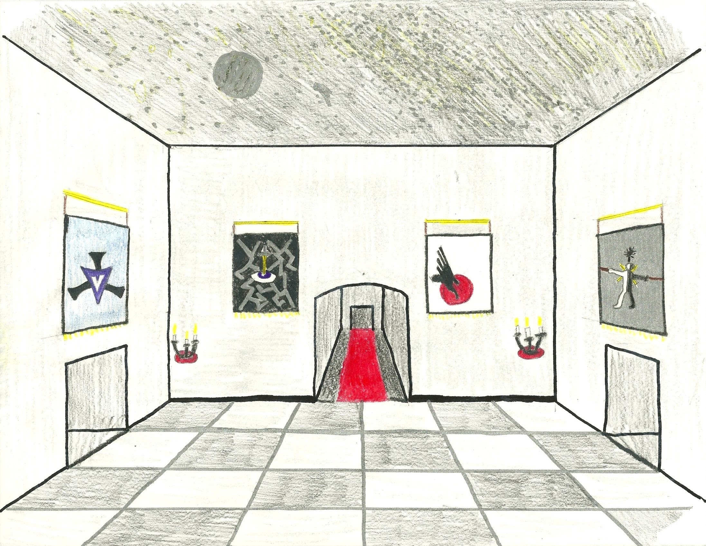

# New Haven

>“More people come everyday. Hope shows them the way. We, the God’s Chosen, have been given this opportunity. To create a beacon of hope in the growing darkness. To love those who have been driven from their homes. From here we will strike courage into the hearts of the meek. From here we will strike fear into the heart of the darkness. From here we shall make our stand. Together, the God’s Chosen will bring light back into the world.” – Lomian Dawnshadow

- [New Haven](#New-Haven)
  - [Introduction](#Introduction)
  - [Gate of the Moon](#Gate-of-the-Moon)
  - [The Celestial Gate](#The-Celestial-Gate)
  - [Gate of the Sun](#Gate-of-the-Sun)
  - [Temple to All Gods](#Temple-to-All-Gods)
  - [The Sister's Infirmary](#The-Sisters-Infirmary)
    - [History](#History)
  - [The Dwarvish Sanctum](#The-Dwarvish-Sanctum)
    - [History](#History-1)
  - [The Elvish Refuge](#The-Elvish-Refuge)
    - [History](#History-2)
  - [The Halfling Roadstead](#The-Halfling-Roadstead)
  - [The Inn of Stars](#The-Inn-of-Stars)
    - [History](#History-3)
    - [Menu](#Menu)
  - [The Specter Garrison](#The-Specter-Garrison)
  - [Training Grounds](#Training-Grounds)
  - [Dragonborn Anchorage](#Dragonborn-Anchorage)
  - [Garrison of the Sun](#Garrison-of-the-Sun)
    - [Architecture](#Architecture)
  - [Town Square](#Town-Square)
  - [The Night's Gate](#The-Nights-Gate)
  - [The Fist of the God's Chosen (The Tor)](#The-Fist-of-the-Gods-Chosen-The-Tor)
    - [Map](#Map)
  - [Old Tom's Farmstead](#Old-Toms-Farmstead)
  - [Stippinger Orchard](#Stippinger-Orchard)
  - [Graveyard of Heroes Past](#Graveyard-of-Heroes-Past)
    - [Graves](#Graves)
- [Crypt of the Chosen](#Crypt-of-the-Chosen)
    - [Tombs](#Tombs)

## Introduction
New Haven was established 200 years after the fall of the Nerathi Empire, by Lomian a member of The God’s Chosen. New Haven was the seat of The God’s Chosen, and construction began on a town in which the refugees of the region my take shelter during these dark times. New Haven is surrounded by a half circle exterior wall, forty feet tall and fifteen feet thick with three gates: the Main Gate is situated on the road and is called the Celestial Gate; there are two identical gates on either side of the circular wall, known as the sister gates one is called the Gate of the Moon and the opposite is called the Gate of the Sun. Situated on the main road, that leads from the Celestial Gate to the Doors of Midnight, is The Inn of the Shining Star.

## Gate of the Moon
The southern gate of New Haven is placed in accordance with the bridge that leads across the River Running. The doors are carved out of a single slab of a Gulthias Tree, detailing a flying castle and the Transcursus flying overhead. Around the massive doors, molten gold has been inlaid into the stone, depicting a full moon over the doors surrounded by a sea of stars.
## The Celestial Gate
The Celestial gate looks west out into a sea of rolling hills. The doors are carved out of a single slab of a Gulthias Tree. With perfect detail, a host of heroes gazes unyielding into the distance. Carved into the living wood are the God’s chosen. In the front are Baurus, Vengenance, Argarwane and Chigaru. Behind them stands Silmarien, Three, Lomian, Gauthak and Shadow. In the background a host of others look into the distance. Around the massive doors, molten gold has been inlaid into the stone, depicting the symbols of the old gods.
## Gate of the Sun
The northern gate of New Haven is placed in accordance with the main road that leads into lands beyond. The doors are carved out of a single slab of a Gulthias Tree, detailing the mighty victories won by the God’s chosen. The pictures show the heroes in all their glory battling the Ancient Red Terror, Ashkahir Faeldaroch, a Balrog atop a tall tower, Orcus within the bowels of the abyss, and the Tarrasque falling into the darkness. Above the massive doors, molten gold has been inlaid into the stone, depicting the radiant sun.
## Temple to All Gods

The Temple to All Gods was established as a symbol of unifying faiths among the Dawn War deities, gods of the Temple Guardian faith. The temple is vast and different chambers host shrines and statues to each of the gods.
## The Sister's Infirmary

Alchemical healers are available for various healing services. The Sisters of Solstice are the most well-trained healers for hundreds of miles around New Haven.

### History

During the rebuilding of New Haven, two sisters built a homestead and administered healing services. It would grow to become something much more.
## The Dwarvish Sanctum

This place now serves as a favorite staying place of dwarves visiting New Haven. In the years following its founding, it was a safe haven for a race that had been run from its ancestral homes.

### History

Baurus himself helped lay the stones that would one day become this Dwarvish refuge.
## The Elvish Refuge

The Elvish Refuge is now mostly used as a retreat for elves in the region. When they must stay in the city but long for the woods, this is the perfect place to be.

### History

Elves brought plants and trees from the Realm of the Vines to grow in and around the refuge.
## The Halfling Roadstead
## The Inn of Stars

The most well-known in for hundreds of miles, the Inn of Stars plays host to all kinds of creatures traveling through the region.

### History

The only ruins left after the burning of New Haven were a few stone walls from the Inn of Stars. It is the only building, besides the Tor to have any of its original structure remaining.

### Menu

## The Specter Garrison
The Merciful have taken up The Spectral Garrison as their base of operation. From here they maintain their banks, train new recruits, hold religious rituals and strike out against the evil that is plaguing Kandalur. The Garrison is well equipped to hold up to 200 soldiers at a time. It is equipped with a Chapel, Mess Hall, Armory, Stables, Smithy, Library and barracks. The grounds themselves are equipped training areas for foot soldiers and for mounted combat.

As far as the architecture is concerned, the curtain wall extends back into the city from the Celestial Gate to form the boundary for the Monastery. The wall continues all the way around the property, closely hugging the city streets. It is not for privacy that the Knights built this wall, but for the protection of the citizens of New Haven. Combat training can be quite involved and they would spare the children the sight of blood. Just inside the wall is a main courtyard, a travertine mosaic gracing the ground. Beyond the courtyard is the main building, three stories, extending above the walls of the city. A round tower connects the two main buildings and contains all the common areas; the library, the mess hall, and the chapel on the top floor. On the other side of the courtyard lies the stable and mounted combat training facility.
## Training Grounds
## Dragonborn Anchorage
## Garrison of the Sun
The Garrison of the Sun was rebuilt in order to accommodate a local militia for times of uncertainty. However, New Haven has known little trouble in recent years and the Garrison was then occupied by the Ambassador to Imperial Alheim. For the last 10 years, the Ambassador has been Lady Brenna. She was a local girl that wanted to serve her people, so she went to Hygahr and became learned in politics. She has served the city well, allocating the necessary resources between the Empire and New Haven. The Embassy is also home to a small security force of 77 soldiers of varying skill sets.

### Architecture

The architecture of the Garrison is simple by design. The curtain wall extends into the city creating a sense of separateness. The idea that the designers wanted to convey, for now, is that the Empire is still a separate entity from the city. The embassy has rooms for all personnel as well as offices for the officers.
## Town Square
## The Night's Gate
## The Fist of the God's Chosen (The Tor)

Deep within the mound, lies the tomb of an unnamed soldier. A small band of heroes, bound together by storm-peace, vanquished the monster that resided within. More than a year later, heroes set out from the mission of the first three make their home at the tor that started it all.

The town of New Haven was created as a base and safe home for all in the surrounding area. Small groups join the town every day as the builders slowly recruit, being careful not to spread word of the safe haven too quickly. Behind the walls of the town and atop the hill, lies the tor that houses some of the greatest heroes of this age. It all started here. The heroes were prepared to make their final stand here as well…

### Map

## Old Tom's Farmstead
Tomminock Nackle is the older of the two brothers and therefore took the larger plot of land. He had wanted to be partners with his brother in everything, but his brother wanted to make his land his own. Old Tom is certainly the more business savvy of the two; he grows the finest wheat and barley on his side of the road. He portions each harvest between three different endeavors. Most of the wheat he sells to traveling merchants or ships to Alheim to be sold, some of the wheat he keeps in order to supply his wife Orda’s bakery, The God’s Chosen Loaf, in town. The rest, both crop and seed of the wheat he ships to struggling towns in the region. He keeps all the barley crops for his brewery in New Haven, which supplies the Inn of Stars with kegs of Ale. His choice drafts are “Little Brother’s Grief” and “Nifty Nackle”.
## Stippinger Orchard
Bobbinock Nackle, now Bobbinock Stippinger, is the younger of the two brothers. He married a young Halfling girl and took her name to spite his family. His father died, he wanted half the land. When he found that they were to share the land, he was furious! He refused to remain in the shadow of his older brother, Tomminock and therefore settled with splitting the lands on the main road. He planted an orchard on his side that has been widely successful. He imported a special fruit that used to be only grown in Aer. His ability to grow the fruit has enabled him to distribute it in Kandalur for a much cheaper price than it was to import it from Aer, making him the sole distributer and allowing him sell each harvest at maximum price. His brother has tried to buy some of his fruits to use in the bakery, but Bobbinock will never sell.
## Graveyard of Heroes Past

A graveyard sits alone on a hill near the Tor entrance. A lone watcher can be seen walking throughout at night, lantern swinging in the silence.

[Atmosphere Music](https://open.spotify.com/track/1ku6iz80ht16xPwQNglXTv?si=CDu4xJBPQDCn9WdYWFmwBA)

>I was waiting, waiting for a long time, In the dark shadow of grey towers, In the dark shadow of grey towers, In the dark shadow of rain towers, You will see me waiting forever, You will see me waiting forever, One day it will come back, Over the lands, over the seas, The blue wind will return, And take back with it my wounded heart, I will be pulled away by its breath, Far away in the stream, wherever it wishes, Wherever it wishes, far away from this world, Between the sea and the stars

### Graves
- Bartrus Belstone
- Ferrigan Numlar
- Hollie Hannely
- Zanne Forester
- Quinn Morlin
- Ricka Aldarion
- King Antoban Heroldi
- Truck Russeln
- Widgeon
- Rendar
- Thalion
- Iltana

# Crypt of the Chosen

[Atmosphere Music](https://open.spotify.com/track/2kk6UFxOXTon8VVUvIFXfD?si=sNPxuickTV6gJReK8gmRNw)

If the [Gravedigger](https://grand-design.obsidianportal.com/characters/gravedigger) lets you pass, you can enter a crypt through the Graveyard of Heroes. The other entrance is well-guarded within the Fist of the God’s Chosen.

This crypt is the final resting place of many of the heroes of the God’s Chosen. Inside, there is no sound but your own footsteps on stone. Torches line the wide hall and a single statue of an angel kneeling greets you at the entrance. Small orbs of light appear, float through the air, and disappear. There’s something otherworldly about this place. Guards, covered in silver and gold armor stand as still as statues, flanking each tomb.

A single, robed figure can often be found kneeling and praying here.

### Tombs
- Argarwane
- Vengeance
- Gauthak
- Jinroy
- A Tribute to Lomian
- A Tribute to Three
- An Unmarked Grave