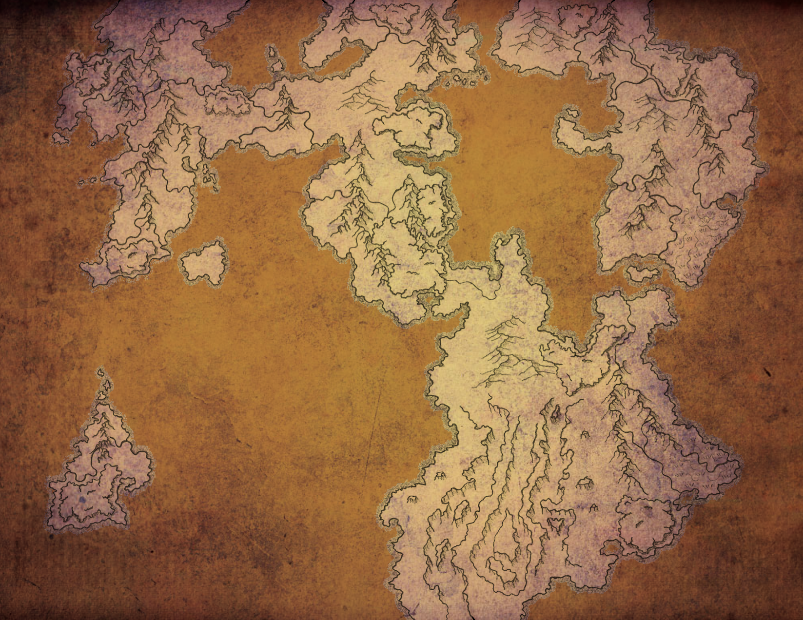

*Map of Kandalur by Kirk Wiebe*

The world as we know it, has grown dark. Our empire, once proud and glorious, now lay in ruins. Since the dawn of mankind, we warred with anyone and everyone to see our kingdoms rise to glory. Merely, a century ago, our civilization had finally reached its pinnacle. Now, look around you. Darkness. Ruins. Evil. But it will not defeat us. We look for the points of light in the darkness. We must turn to our brothers in the mountains and forests. We’re no longer enemies. But we are hunted. Change that. Show them that we are the hunters. We are the architects of the new world and evil is not part of our Grand Design. Join others and fight to build a new world. Its up to you.
